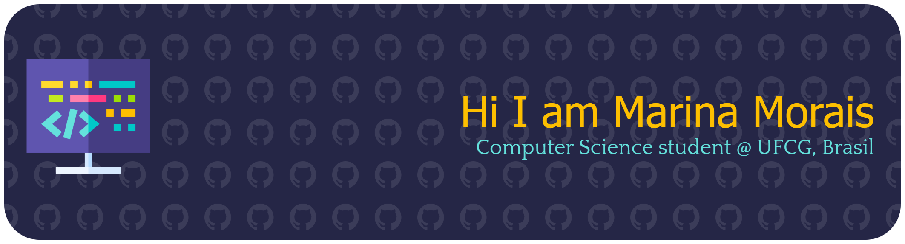

  

### 
Hi, I'm Marina 👋
  
  

- 🔭 I’m currently colaborating with PETComp UFCG  
  

- 💪I love learning new things and becoming the best version of myself!  
  

   

## Main Skills

   

## Connect with me  

  

  
  

   

